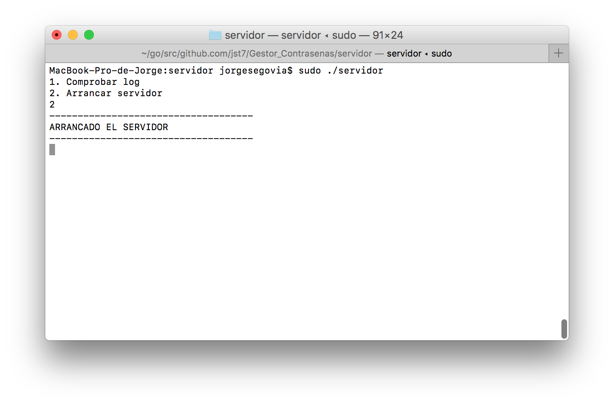
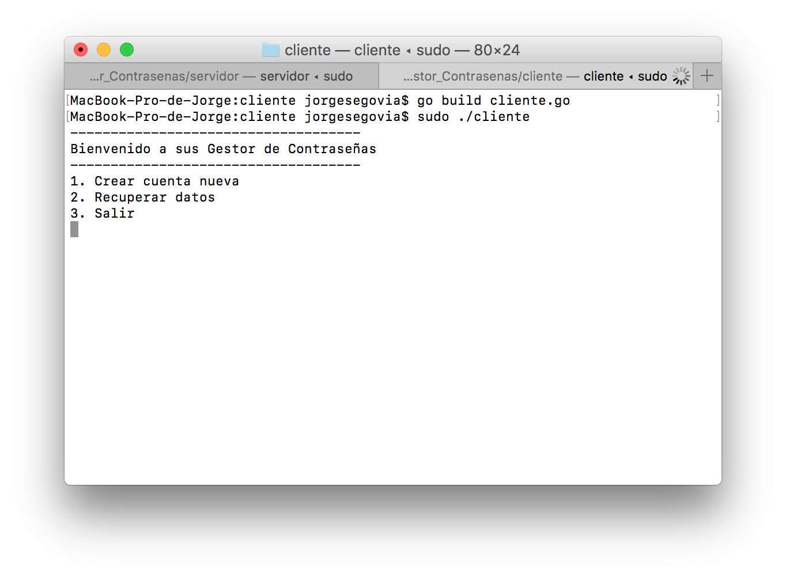

# Gestor de Contraseñas
### Indice
#### Otras alternativas FRAN

#### Nuesstra Práctica

- Certificados JORGE x
- Comunicación JORGE x
- Usuarios y cuentas MOLPE	
- Optativo
	- Doble autentificación con Correo JORGE x
	- Conocimiento 0 JORGE 
	- Log de la aplicación Servidor JORGE x
	- Información adicional Usuarios MOLPE
	- Cifrado archivos con contraseña maestra MOLPE
- Metodología de trabajo FRAN
- Puesta en marcha JORGE x
- Ejemplo de ejecución FRAN

___
	
## Otras alternativas
## Nuestra Práctica
### Certificados

Hemos creado los certificados

Usando:
**Key considerations for algorithm "RSA" ≥ 2048-bit**
`
openssl genrsa -out server.key 2048
`
`
openssl ecparam -genkey -name secp384r1 -out server.key
`
``openssl req -new -x509 -sha256 -key server.key -out server.crt -days 3650``

Para la comunicación algo similar en base a esto en el cliente y servidor:

```GO
func main() {
	log.SetFlags(log.Lshortfile)

	cer, _ := tls.LoadX509KeyPair("server.crt", "server.key")

	config := &tls.Config{Certificates: []tls.Certificate{cer}}
	ln, _ := tls.Listen("tcp", ":443", config)

	defer ln.Close()

	for {
		conn, _ := ln.Accept()

		go handleConnection(conn)
	}
}

//conexion entre el cliente y el servidor
func handleConnection(conn net.Conn) {
	defer conn.Close()
	r := bufio.NewReader(conn)
	for {
		msg, _ := r.ReadString('\n')

		println("Mensaje recibido:")
		println(msg)
		println("mensaje a responder(enviar):")
		var linea string
		fmt.Scanf("%s\n", &linea)

		conn.Write([]byte(linea + "\n"))
		//n, _err := conn.Write([]byte(linea + "\n"))

	}

}

```
### Comunicación
Para la comunicación hemos realizado un tunel TLS con cabeceras entre cliente y servidor.
Para ello hemos creado una estructura con estos campos:

**Servidor:**

```GO

type peticion struct {
	Tipo    string   `json:"tipo"`
	Cookie  string   `json:"cookie"`
	Usuario usuario  `json:"usuario"`
	Clave   string   `json:"clave"`
	Cuentas []cuenta `json:"cuenta"`
}

type usuario struct {
	Name    string   `json:"nombre"`
	Correo  string   `json:"correo"`
	Cuentas []cuenta `json:"cuentas"`
}

type cuenta struct {
	Usuario    string `json:"usuario"`
	Contraseña string `json:"contraseña"`
	Servicio   string `json:"servicio"`
	//Clave string `json:"clave"`
	//ID    string `json:"id"`
}
```

Lo importante seria la cabecera tipo que sería la que redigiría las peticiones del cliente. Por otro lado, tenemos la cookie para la sesion, usuario que es un tipo de usuario y cuentas.

**Cliente:**
El cliente tendría la misma petición y la estructura respesta donde recibe si la petición ha sido realizada correctamente o no:

````GO
type peticion struct {
	Tipo    string   `json:"tipo"`
	Cookie  string   `json:"cookie"`
	Usuario usuario  `json:"usuario"`
	Cuentas []cuenta `json:"cuentas"`
	Clave   string   `json:"clave"`
}
type respuesta struct {
	Estado     string `json:"estado"`
	Cookie     string `json:"cookie"`     
	TipoCuerpo string `json:"tipocuerpo"`
	Cuerpo     []byte `json:"respuesta"`
}

````
### Parte optativa

#### Doble autentificación con Correo

El correo lo hemos utilizado para una doble autentificación. En el servidor, usando una cuenta generica de GMAIL; `func email(correo string, mensaje string)` Le pasamos el correo y el mensaje.

```GO
func (s *SmtpServer) ServerName() string {
	return s.host + ":" + s.port
}

func (mail *Mail) BuildMessage() string {
	message := ""
	message += fmt.Sprintf("From: %s\r\n", mail.senderId)
	if len(mail.toIds) > 0 {
		message += fmt.Sprintf("To: %s\r\n", strings.Join(mail.toIds, ";"))
	}

	message += fmt.Sprintf("Subject: %s\r\n", mail.subject)
	message += "\r\n" + mail.body

	return message
}

func email(correo string, mensaje string) {

	mail := Mail{}
	mail.senderId = "sdspoleo@gmail.com"
	mail.toIds = []string{correo}
	mail.subject = "Autentificacion"
	mail.body = mensaje

	messageBody := mail.BuildMessage()

	smtpServer := SmtpServer{host: "smtp.gmail.com", port: "465"}

	log.Println(smtpServer.host)
	//build an auth
	auth := smtp.PlainAuth("", mail.senderId, "qwertyqwerty", smtpServer.host)

	// Gmail will reject connection if it's not secure
	// TLS config
	tlsconfig := &tls.Config{
		InsecureSkipVerify: true,
		ServerName:         smtpServer.host,
	}

	conn, err := tls.Dial("tcp", smtpServer.ServerName(), tlsconfig)
	if err != nil {
		log.Panic(err)
	}

	client, err := smtp.NewClient(conn, smtpServer.host)
	if err != nil {
		log.Panic(err)
	}

	// step 1: Use Auth
	if err = client.Auth(auth); err != nil {
		log.Panic(err)
	}

	// step 2: add all from and to
	if err = client.Mail(mail.senderId); err != nil {
		log.Panic(err)
	}
	for _, k := range mail.toIds {
		if err = client.Rcpt(k); err != nil {
			log.Panic(err)
		}
	}

	// Data
	w, err := client.Data()
	if err != nil {
		log.Panic(err)
	}

	_, err = w.Write([]byte(messageBody))
	if err != nil {
		log.Panic(err)
	}

	err = w.Close()
	if err != nil {
		log.Panic(err)
	}

	client.Quit()

	log.Println("Mail sent successfully")
}


```
El mensaje lo generamos con una funcion aleatoria y lo almacenamos en memoria en el servidor en una estructura donde se almacena el correo-valor.

````GO
//Estructura
type correoValor struct {
	Correo string `json:"correo"`
	clave  string `json:"clave"`
}

//variable en memoria temporal con las relaciones clave-valor
var listaCorreoClave []correoValor

````

Lo almacenamos así:

```GO
key := mrand.Intn(9999)
valor := correoValor{obj.Correo, strconv.Itoa(key)}
listaCorreoClave = append(listaCorreoClave, valor)

```

	
#### Conocimiento 0
El servidor no tiene capacidad de cifrar el usuario ni su nombre ni nada del cuerpo solo tiene la capacidad de comprobar el bcrypt. 
Por otro lado, a la hora de leer y escribiri lo hace usando por encima AES.

### Log de la aplicación Servidor
Guardamos un log de las operaciones que ha realizado el servidor por si tenemos algun problema poder observar los pasos dados.

```GO
func escribirLog(data string) bool {
	var log = false
	t := time.Now()
	var stringHora = string(t.Format("20060102150405"))
	var linea = stringHora + ": " + data
	log = escribirArchivoClientes("log.txt", linea)

	return log
}

//Aprovechado de otro funcion el metodo de escribir
func escribirArchivoClientes(file string, data string) bool {

	var escrito = false
	if file != "" {
		f, err := os.OpenFile(file, os.O_RDWR|os.O_APPEND, 0666)
		if err != nil {
			log.Fatal(err)
		} else {
			_, error := f.WriteString(data + "\n")
			if error != nil {
				log.Fatal(error)
			}

			escrito = true

			f.Sync()
			f.Close()
		}
	}

	return escrito
}

```

### Puesta en marcha

Para poner en marcha tenemos que tener los directorios:

- Cliente/  
	- /cliente.go
- Servidor/
	- /server.crt
	- /server.key
	- /servidor.go

Compilamos: 

`
go build cliente.go
`
`
go build servidor.go
`

Ejecutamos: 

`
sudo ./cliente
`
`
sudo ./servidor
`



